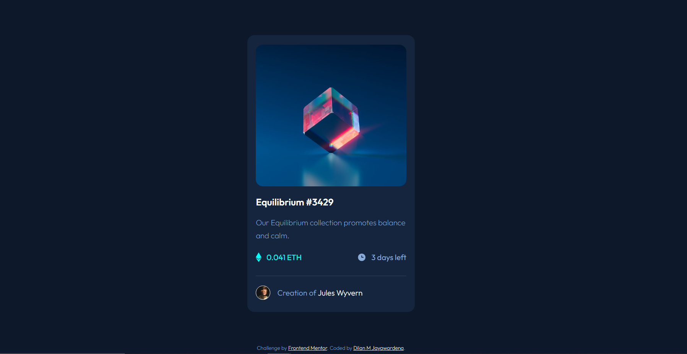
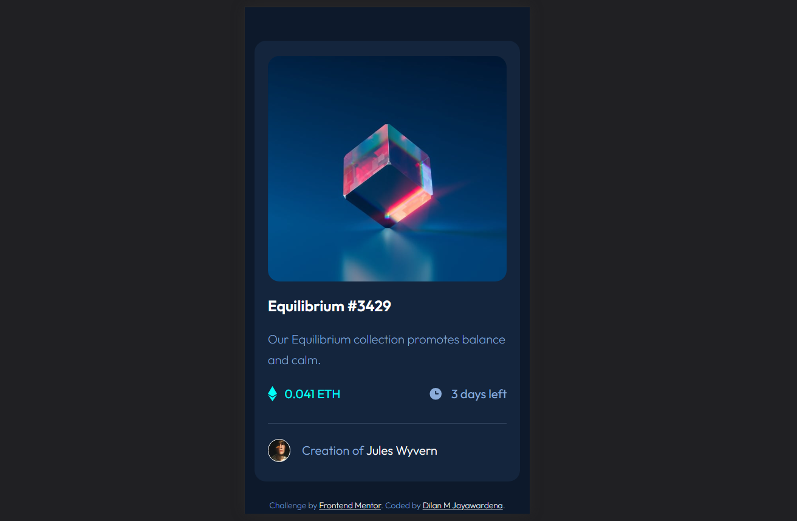

# Frontend Mentor - NFT preview card component solution

This is a solution to the [NFT preview card component challenge on Frontend Mentor](https://www.frontendmentor.io/challenges/nft-preview-card-component-SbdUL_w0U). Frontend Mentor challenges help you improve your coding skills by building realistic projects. 

## Table of contents

- [Overview](#overview)
  - [The challenge](#the-challenge)
  - [Screenshot](#screenshot)
  - [Links](#links)
- [My process](#my-process)
  - [Built with](#built-with)
  - [What I learned](#what-i-learned)
  - [Continued development](#continued-development)
  - [Useful resources](#useful-resources)
- [Author](#author)
- [Acknowledgments](#acknowledgments)

**Note: Delete this note and update the table of contents based on what sections you keep.**

## Overview

This is a front-end project that involves creating an NFT (Non-Fungible Token) preview card component. The component showcases an NFT with its description, updates, and creator information.
### The challenge

Users should be able to:

- View the optimal layout depending on their device's screen size
- See hover states for interactive elements

### Screenshot

**Note: Delete this note and the paragraphs above when you add your screenshot. If you prefer not to add a screenshot, feel free to remove this entire section.**

### Links

- Solution URL Github repository : [here](https://github.com/iamdylanmj/NFT-Card-Component.git)
- Live Site URL: [here](https://iamdylanmj.github.io/NFT-Card-Component/)

## My process

### Built with

- Semantic HTML5 markup
- Sass
- CSS custom properties
- Flexbox
- CSS Grid
- Google Fonts
- CSS Variables (Custom Properties)
- Mobile-first workflow

### What I learned

By doing this project I have had the opportunity to implement the knowladge practically as a newbie developer, 

### Useful resources

- [Coder Coder youtube channel ](https://www.youtube.com/watch?v=jfMHA8SqUL4&t=2191s) - This helped me for learning some Sass and also how to organize file structure within the project. I really liked this pattern and will use it going forward.

## Author
- Frontend Mentor - [@yourusername](https://www.frontendmentor.io/profile/yourusername)
